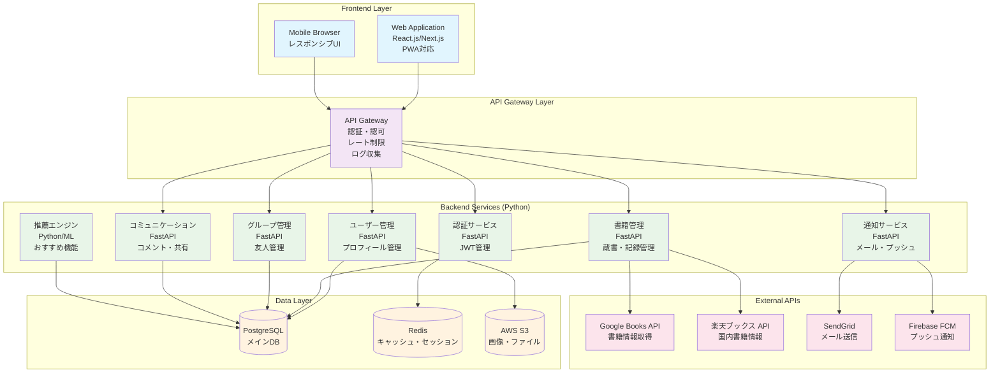
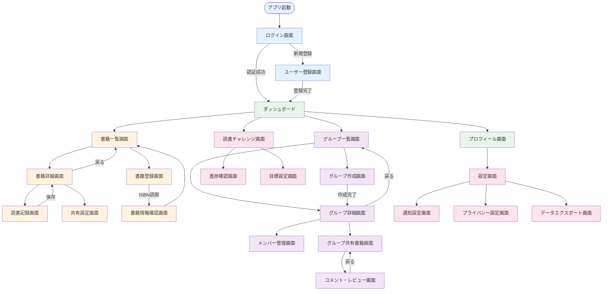
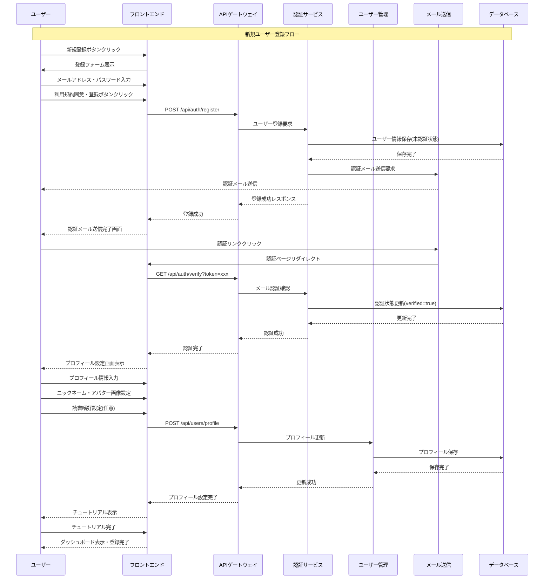
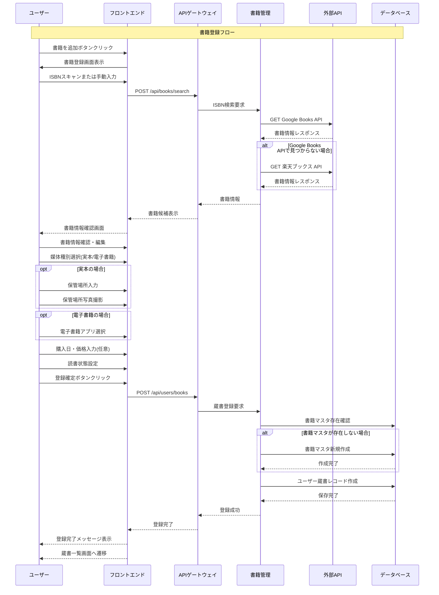
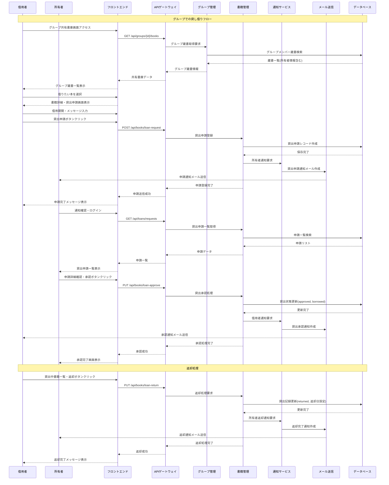

# 個人・グループ向け書庫管理システム 外部設計書

**文書バージョン:** v1.0  
**作成日:** 2025年5月31日  
**作成者:** システムアーキテクト

---

## 1. 目的・概要
- **目的**  
  個人の蔵書管理から友人グループでの書籍共有まで、親しい人たちとの読書体験を豊かにするWebサービスを提供する。読書習慣の可視化、友人との読書コミュニケーション、効率的な書籍共有を通じて読書ライフの充実を支援する。

- **概要**  
  本システムは、個人ユーザーが自身の蔵書を管理し、親しい友人グループと書籍情報を共有できるWebアプリケーションである。ISBNスキャンによる書籍登録、読書状態管理、グループ内での本の貸し借り記録、読書コミュニケーション機能を提供し、温かみのあるプライベートなコミュニティ空間を創出する。

---

## 2. システム構成図

- **フロントエンド**: React.js/Next.js によるSPA、PWA対応でオフライン機能提供
- **APIゲートウェイ**: 認証・認可、レート制限、ログ収集を統合管理
- **バックエンドサービス**: Python/FastAPIによるマイクロサービス構成
  - 認証サービス: JWT管理、セッション制御
  - ユーザー管理: プロフィール、アカウント管理
  - 書籍管理: 蔵書登録、読書記録
  - グループ管理: 友人グループ
  - コミュニケーション: コメント、共有機能
  - 通知サービス: メール・プッシュ通知
  - 推薦エンジン: Python/ML による個人化推薦
- **データ層**: PostgreSQL(メインDB)、Redis(キャッシュ)、AWS S3(ファイル)
- **外部API**: Google Books、楽天ブックス、SendGrid、Firebase FCM

---

## 3. 機能一覧・機能仕様

| No. | 機能名 | 機能概要 | 利用者 | 備考 |
|------|--------|----------|--------|------|
| 1 | ユーザー認証・アカウント管理 | メール認証、ソーシャルログイン、プロフィール管理 | 全ユーザー | 二要素認証対応 |
| 2 | 個人蔵書登録・管理 | ISBNスキャン、書籍情報登録、読書状態管理 | 個人ユーザー | 実本/電子書籍区別 |
| 3 | 読書記録・進捗管理 | 読書開始日、完了日、評価、感想記録 | 個人ユーザー | |
| 4 | 保管場所管理 | 本の保管場所を写真付きで記録 | 個人ユーザー | |
| 5 | グループ作成・招待 | 友人グループ作成、メンバー招待機能 | 個人ユーザー | 最大20名 |
| 6 | 共有書庫管理 | グループ内での蔵書共有、所有状況確認 | グループメンバー | |
| 7 | 貸し借り管理 | 本の貸し借り記録、履歴管理 | グループメンバー | |
| 8 | 読書コミュニケーション | コメント交換、進捗共有、写真共有 | グループメンバー | |
| 9 | おすすめ・レビュー共有 | 個人的な推薦、グループ内レビュー | グループメンバー | |
| 10 | 読書チャレンジ | 個人・グループの読書目標設定・管理 | 全ユーザー | |
| 11 | 通知機能 | 貸し借り通知、コメント通知、チャレンジ達成通知 | 全ユーザー | |
| 12 | 検索・フィルタ機能 | 蔵書検索、読書状態別フィルタ | 全ユーザー | |

---

## 4. 画面設計（UI仕様）

### 4.1 ログイン画面
- **画面概要**: ユーザー認証を行う初期画面
- **入力項目・出力項目一覧**

| 項目名 | 種別 | 必須 | 内容説明 |
|--------|------|------|----------|
| メールアドレス | 文字列 | ○ | ログイン用メールアドレス |
| パスワード | 文字列 | ○ | 8-128文字のパスワード |
| ログイン状態保持 | チェックボックス | - | 30日間のログイン保持 |

### 4.2 個人蔵書一覧画面
- **画面概要**: 個人が所有する書籍の一覧表示・管理
- **入力項目・出力項目一覧**

| 項目名 | 種別 | 必須 | 内容説明 |
|--------|------|------|----------|
| 書籍タイトル | 表示項目 | - | 書籍名 |
| 著者名 | 表示項目 | - | 著者情報 |
| 読書状態 | 選択肢 | ○ | 積読/読書中/読了/お気に入り |
| 媒体種別 | 表示項目 | - | 実本/電子書籍/両方 |
| 評価 | 星5段階 | - | 個人評価 |
| 保管場所 | 文字列+画像 | - | 保管場所情報 |

### 4.3 書籍登録画面
- **画面概要**: 新しい書籍を蔵書に追加する
- **入力項目・出力項目一覧**

| 項目名 | 種別 | 必須 | 内容説明 |
|--------|------|------|----------|
| ISBN | 文字列 | - | ISBNコード（スキャン対応） |
| 書籍タイトル | 文字列 | ○ | 書籍名 |
| 著者名 | 文字列 | ○ | 著者情報 |
| 媒体種別 | 選択肢 | ○ | 実本/電子書籍 |
| 電子書籍アプリ | 選択肢 | △ | Kindle/楽天Kobo/Apple Books等 |
| 購入日 | 日付 | - | 購入日 |
| 購入価格 | 数値 | - | 購入価格 |
| 保管場所 | 文字列 | - | 保管場所 |
| 保管場所写真 | 画像 | - | 保管場所の写真 |

### 4.4 グループ共有書庫画面
- **画面概要**: グループメンバーの蔵書を一覧表示
- **入力項目・出力項目一覧**

| 項目名 | 種別 | 必須 | 内容説明 |
|--------|------|------|----------|
| 所有者名 | 表示項目 | - | 書籍所有者 |
| 書籍情報 | 表示項目 | - | タイトル、著者 |
| 貸出状況 | 表示項目 | - | 利用可能/貸出中 |
| 媒体種別 | 表示項目 | - | 実本/電子書籍 |
| 貸し借り申請 | ボタン | - | 貸出申請機能 |

### 4.5 読書コミュニケーション画面
- **画面概要**: グループ内での読書に関するコミュニケーション
- **入力項目・出力項目一覧**

| 項目名 | 種別 | 必須 | 内容説明 |
|--------|------|------|----------|
| コメント内容 | テキストエリア | ○ | 500文字以内 |
| 関連書籍 | 選択肢 | - | 言及する書籍 |
| 画像添付 | ファイル | - | 本の写真等 |
| コメント一覧 | 表示項目 | - | 過去のコメント履歴 |

**画面遷移図:**

---

## 5. 入出力仕様

### 入力データ仕様
- **書籍データCSV**: ISBN, タイトル, 著者, 出版社, 出版日
- **プロフィール画像**: JPEG, PNG, WebP (最大5MB)
- **保管場所写真**: JPEG, PNG, WebP (最大10MB)

### 出力データ仕様
- **読書統計レポート**: PDF形式の月次/年次読書レポート
- **蔵書エクスポート**: CSV形式での個人蔵書データ
- **グループ活動レポート**: グループの読書活動サマリー

---

## 6. 操作フロー・業務フロー

### 6.1 新規ユーザー登録フロー
1. アプリ起動後、「新規登録」ボタンをクリック
2. メールアドレス、パスワードを入力
3. 利用規約・プライバシーポリシーに同意
4. 「登録」ボタンをクリック
5. 認証メールが送信される
6. メール内の認証リンクをクリック
7. プロフィール情報（ニックネーム、アバター画像）を設定
8. 読書に関する興味・嗜好を設定（任意）
9. チュートリアル表示
10. ダッシュボードへ遷移、登録完了

### 6.2 書籍登録フロー
1. ログイン後、「書籍を追加」ボタンをクリック
2. ISBNをカメラでスキャンまたは手動入力
3. 書籍情報の自動取得・確認
4. 媒体種別（実本/電子書籍）を選択
5. 保管場所情報を入力・撮影
6. 読書状態を設定
7. 登録完了

### 6.3 グループでの貸し借りフロー
1. グループ共有書庫で借りたい本を検索
2. 「借りたい」ボタンをクリック
3. 所有者に通知送信
4. 所有者が承認
5. 貸出記録の作成
6. 返却時の記録更新

---

## 7. 外部インターフェース仕様

### 7.1 ISBN書籍情報API
- **連携先**: openBD API、Google Books API
- **連携方式**: REST API (HTTPS)
- **データ形式**: JSON
- **主要項目**: ISBN, title, author, publisher, publishedDate, thumbnail

### 7.2 ソーシャルログインAPI
- **Google OAuth 2.0**
  - スコープ: profile, email
  - リダイレクトURI: https://domain.com/auth/google/callback
- **Apple Sign In**
  - スコープ: name, email
  - リダイレクトURI: https://domain.com/auth/apple/callback

### 7.3 メール送信API
- **連携先**: SendGrid, AWS SES
- **用途**: アカウント認証、通知メール
- **テンプレート**: 招待メール、パスワードリセット、通知メール

---

## 8. データ設計（論理設計）

### 主要テーブル一覧

| テーブル名 | 説明 | 主なカラム |
|------------|------|------------|
| users | ユーザー情報 | user_id, email, name, profile_image, created_at |
| books | 書籍マスタ情報 | book_id, isbn, title, author, publisher, published_date |
| user_books | ユーザー蔵書 | user_book_id, user_id, book_id, status, rating, notes, medium_type |
| groups | グループ情報 | group_id, name, description, created_by, created_at |
| group_members | グループメンバー | group_id, user_id, role, joined_at |
| book_loans | 貸し借り記録 | loan_id, lender_id, borrower_id, user_book_id, status, loan_date |
| comments | コメント | comment_id, user_id, group_id, book_id, content, created_at |
| reading_goals | 読書目標 | goal_id, user_id, target_count, period, created_at |

### データ項目詳細
- **medium_type**: 'physical', 'digital', 'both'
- **digital_app**: 'kindle', 'kobo', 'apple_books', 'others'
- **reading_status**: 'want_to_read', 'reading', 'read', 'favorite'
- **loan_status**: 'requested', 'approved', 'borrowed', 'returned'

---

## 9. 非機能要件

### 性能要件
- 応答時間: 3秒以内（書籍検索、ページ遷移）
- 同時接続数: 1,000ユーザー
- 可用性: 99.9%（月間ダウンタイム43分以内）

### セキュリティ要件
- HTTPS通信の強制
- JWT認証トークンの実装
- パスワードのハッシュ化（bcrypt）
- 二要素認証（SMS/メール）
- アカウントロック機能（5回連続失敗で15分ロック）
- XSS、CSRF対策の実装

### 保守性・運用要件
- ログ記録: アクセスログ、エラーログ、セキュリティログ
- 監視: サーバー死活監視、パフォーマンス監視
- バックアップ: 日次データベースバックアップ

---

## 10. 制約条件・前提条件

### 技術制約
- 最新ブラウザ対応（Chrome, Firefox, Safari, Edge）
- モバイル対応（iOS 14+, Android 10+）
- Python 3.9+ + Django 4.2+
- PostgreSQL 13+
- Redis 6.0+

### 利用制約
- 個人蔵書上限: 5,000冊
- グループ参加上限: 20名
- 画像アップロード制限: 10MB/ファイル
- 無料プランストレージ: 1GB/ユーザー

### 前提条件
- インターネット接続環境
- カメラ機能付きデバイス（ISBNスキャン用）
- メールアドレスの保有

---

## 11. エラーハンドリング

### 認証関連エラー
- **E001**: 「メールアドレスまたはパスワードが正しくありません」
- **E002**: 「アカウントがロックされています。15分後に再試行してください」
- **E003**: 「メール認証が完了していません。認証メールを確認してください」

### データ入力エラー
- **E101**: 「必須項目が入力されていません」
- **E102**: 「文字数制限を超えています（最大○○文字）」
- **E103**: 「不正な形式です。正しい形式で入力してください」

### システムエラー
- **E901**: 「一時的にサービスが利用できません。しばらく後に再試行してください」
- **E902**: 「ネットワークエラーが発生しました。接続を確認してください」

### ログ出力
- エラーレベル: ERROR, WARN, INFO, DEBUG
- 出力先: ファイル + 外部ログ管理サービス
- 個人情報マスキング対応